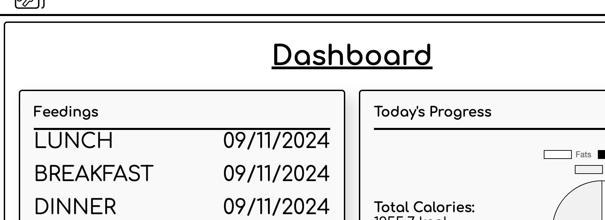
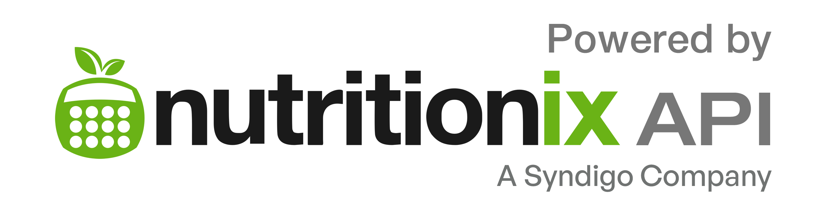

# Daily Bread
## a calories tracking app

### Description:
Daily Bread: a basic calories tracking app built using Django. The app integrates a third-party API, NutritionIX, to fetch nutritional data which users can then perform CRUD actions with.

After users create an account and accompanying profile, users can then search for different foods, categorize them by meal, and create entries, tracking nutrional data: calories, fats, proteins, carbs.

### Background:
This project grew from a personal interest in health and fitness. A healthy lifestyle constitutes exercise and proper diet. This app aims to help users reach their diet and nutrition goals by tracking the three main nutrients (macronutrients): fats, proteins, and carbohyrates, as well as calories.

By tracking these elements, users can gain a better sense of their day-to-day, even meal-to-meal, progress toward their goals. Whether they follow a 40-40-20 (40% protein, 40% carbohydrates, 20%) plan, or a stricter 50-35-15 plan, users can make sure they hit their macro and calorie goals consistently.

### Development:
Development of the app did not come without challenges. The two main challenges encountered came when trying to integrate formsets into meal forms and when trying to add more forms when updating an existing meal.

#### Formset integration:
When creating a meal entry, users can add one or multiple food items. Users search and fetch the food item data, which automatically populates a form of the formset upon selection. The challenges arose when adding another form for multiple food items. Three JavaScript functions (`addFoodItemBtn`, `updateFormIndex`, `addRemoveHandlers`) helped by creating, removing, and updating the total form count. These functions operate directly from the `dashboard.html` template.

#### Adding forms when updating existing meal:
When users edit a meal, they can also add new food items. At first, the `feeding_form.html` template would clone an existing form, which the user can then edit as a new food item. This created cloned form ids which would cause the `save()` to only apply to the newest form. To acheive the desired outcome, a similar solution to the prior allowed users to `addForm()` while also allowing editing to existing forms, and track the total forms. The tracking of total forms, whether adding or removing them, presented the biggest challenge for this feature.

## Getting Started:
[Daily Bread](https://dailybread-5cf707dc2446.herokuapp.com/accounts/signup/)

Navigate to the link above and sign up for an account, filling in the necessary fields. Once signed up, you can start adding meals with one or more food items using the search bar right from your dashboard.

## Attributions:

## Technologies:

## Next steps:
- add additional relevant data for users like progress toward calorie limits or nutrients, exercise needed to burn certain calorie entries
- refine sign up view
- change edit view to reflect food items as cards similar to dashboard